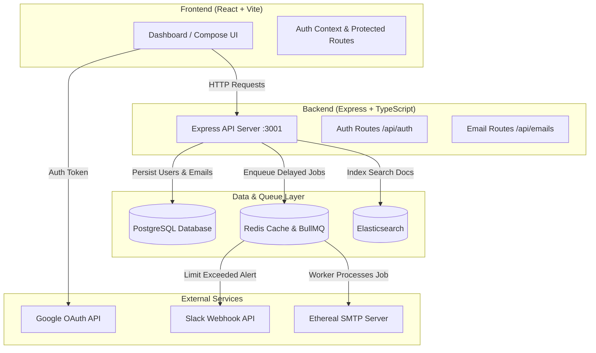

# ReachInbox.ai - Distributed Email Job Scheduler & Analytics Dashboard

A full-stack, production-grade email job scheduling system and dashboard built for high-throughput, delayed email delivery, rate limiting, Slack notifications, and search indexing.


---

## 🌟 Key Features

### 🔐 Google OAuth & Per-User Session Management
- **Google Authentication**: Login via `@react-oauth/google` with backend token verification via Google's OAuth API.
- **Session State**: Global React `AuthContext` with local storage persistence and protected routes (`ProtectedRoute`).
- **Resilient Fallback**: Demo user login fallback enabled for easy local development without mandatory OAuth keys.

### 📬 Distributed Email Scheduling (BullMQ + Redis)
- **Zero Cron Dependencies**: Leverages BullMQ's native delayed job scheduler powered by Redis.
- **Server Restart Persistence**: Jobs scheduled in Redis survive backend process restarts and execute accurately when the server comes back online.
- **Idempotent Scheduling**: Database constraints (`ON CONFLICT DO NOTHING`) prevent duplicate job creation across retries.
- **SMTP Ethereal Mail Integration**: Generates real Ethereal SMTP test message URLs clickable directly from the email detail page.

### ⚡ Per-User Slack OAuth & Webhook Integration
- **Slack OAuth Flow**: `/api/auth/slack` OAuth authorization flow allowing users to connect their Slack workspaces.
- **Per-User Webhooks**: Stores `slack_webhook_url` per user in PostgreSQL.
- **Rate Limit Alerts**: When a user's hourly send limit is reached, BullMQ worker automatically posts a warning notification to that specific user's Slack webhook.

### 🔍 Dual Search Engine System
- **Elasticsearch Integration**: Indexes all scheduled and sent emails for full-text search.
- **PostgreSQL Fallback**: Automatically falls back to SQL `ILIKE` queries across `subject`, `body`, and `recipient` if Elasticsearch is offline.

### 📊 Admin Queue Dashboard
- Visual BullMQ monitoring board available natively at `http://localhost:3001/admin/queues` to inspect active, delayed, completed, and failed jobs.

### 🎨 Pixel-Perfect Figma-Matched UI
- Designed with Tailwind CSS v4, custom status badges (`Scheduled`, `Sent`, `Failed`), search filter toolbar, email composer with text/CSV bulk upload, and dark/light UI accents.

---

## 🏗️ Architecture Overview



---

## 🛠️ Tech Stack

- **Frontend**: React 18, TypeScript, Vite 6, Tailwind CSS v4, Lucide React Icons, `@react-oauth/google`, React Router v7
- **Backend**: Node.js v20+, Express.js, TypeScript, BullMQ, Redis, PostgreSQL (`pg`), Ethereal SMTP (`nodemailer`)
- **Job Processing**: Redis + BullMQ (2s delay per email rate buffer, configurable concurrency)

---

## 📋 Prerequisites

Before starting, ensure you have the following installed locally:

- **Node.js**: v18.0.0 or higher (v20.x recommended)
- **PostgreSQL**: Running locally on port `5432` with database `reachinbox` created
- **Redis**: Running locally on port `6379` (Redis Server or Memurai on Windows)

---

## ⚙️ Environment Configuration

### Backend Environment Variables (`backend/.env`)

Create a `.env` file inside the `backend/` directory:

```env
PORT=3001
FRONTEND_URL=http://localhost:5174

# Database
DB_HOST=localhost
DB_PORT=5432
DB_USER=postgres
DB_PASSWORD=postgres
DB_NAME=reachinbox

# Redis & Queue
REDIS_HOST=localhost
REDIS_PORT=6379

# Elasticsearch (Optional fallback to PostgreSQL ILIKE)
ELASTICSEARCH_NODE=http://localhost:9200

# Ethereal SMTP Credentials (Auto-generated or custom)
SMTP_HOST=smtp.ethereal.email
SMTP_PORT=587
SMTP_USER=harley.boyer@ethereal.email
SMTP_PASS=Ggc6fDD6z6wActZf7r

# Slack OAuth (Optional for live Slack Connect)
SLACK_CLIENT_ID=your_slack_client_id
SLACK_CLIENT_SECRET=your_slack_client_secret
SLACK_REDIRECT_URI=http://localhost:3001/api/auth/slack/callback
```

### Frontend Environment Variables (`frontend/.env`)

Create a `.env` file inside the `frontend/` directory (optional for real Google Client ID):

```env
VITE_GOOGLE_CLIENT_ID=your_google_client_id.apps.googleusercontent.com
VITE_API_BASE_URL=http://localhost:3001/api
```

---

## 🚀 Step-by-Step Setup Guide

### 1. Database Setup
Create the `reachinbox` database in PostgreSQL:
```bash
psql -U postgres -c "CREATE DATABASE reachinbox;"
```
*(The backend automatically creates `users` and `emails` tables and migrations upon startup).*

### 2. Backend Installation & Startup
```bash
cd backend
npm install
npm run dev
```
- Server running at: `http://localhost:3001`
- BullMQ Board running at: `http://localhost:3001/admin/queues`

### 3. Frontend Installation & Startup
Open a new terminal window:
```bash
cd frontend
npm install
npm run dev
```
- Frontend app running at: `http://localhost:5174` (or `http://localhost:5175`)

---

## 🧪 Demonstration & Testing Scenarios

### 1. Creating Scheduled Emails
1. Log into the dashboard.
2. Click **Compose Email**.
3. Fill in recipient emails (or use **Upload List** to parse text/CSV files).
4. Set a future schedule time (e.g. 2 minutes ahead).
5. Click **Schedule Email**.
6. Observe the email appearing immediately in the **Scheduled** tab.

### 2. Server Restart Scenario (Persistence Test)
1. Schedule an email for 3 minutes in the future.
2. Stop the backend server (`Ctrl + C` in the backend terminal).
3. Wait 1 minute, then restart the backend server (`npm run dev`).
4. **Result**: The BullMQ queue restores jobs from Redis and fires the email on schedule when the time arrives.

### 3. Rate Limiting & Slack Webhook Trigger
1. Set low hourly limit in compose (e.g., 2 emails/hour).
2. Schedule 5 emails simultaneously.
3. The queue worker processes the first 2 emails, detects rate limit overflow on the 3rd email, applies delay buffers, and dispatches a Slack webhook alert to the connected user's Slack workspace.

### 4. Ethereal Email Preview
1. Navigate to **Sent** emails on the dashboard.
2. Click any sent email row to open `/email/:id`.
3. Click the **View Ethereal Preview** link to view the rendered email in Ethereal Mail.

---

## 📡 API Endpoint Reference

| Method | Endpoint | Description |
| :--- | :--- | :--- |
| `POST` | `/api/auth/google` | Authenticate user via Google OAuth token |
| `GET` | `/api/auth/slack` | Initiate Slack OAuth authorization flow |
| `GET` | `/api/auth/slack/callback` | OAuth callback to exchange code & store user Slack webhook |
| `POST` | `/api/emails/schedule` | Schedule email(s) with rate limits and delays |
| `GET` | `/api/emails/scheduled` | Fetch all pending scheduled emails |
| `GET` | `/api/emails/sent` | Fetch all successfully sent emails |
| `GET` | `/api/emails/search?q=query` | Full-text search across subject, body, and recipient |
| `GET` | `/api/emails/:id` | Fetch email by ID including preview URL |
| `GET` | `/admin/queues` | BullMQ Visual Queue Management Dashboard |

---

## 📜 License

MIT License. Designed and developed for ReachInbox.ai Engineering Assignment.
